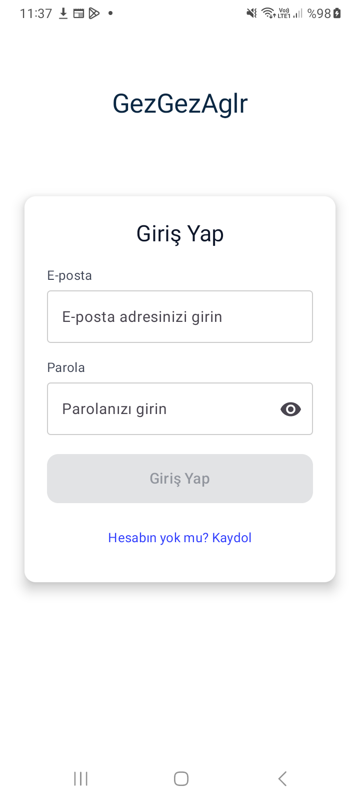
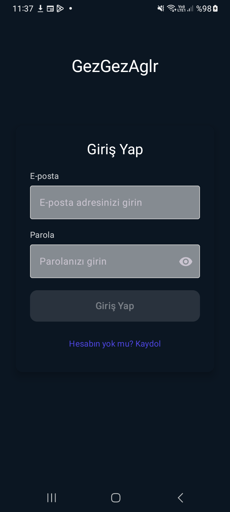
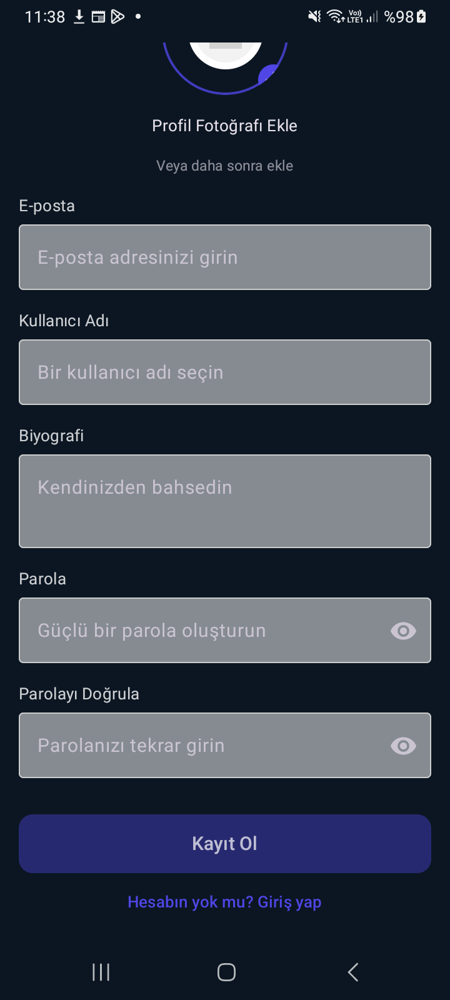
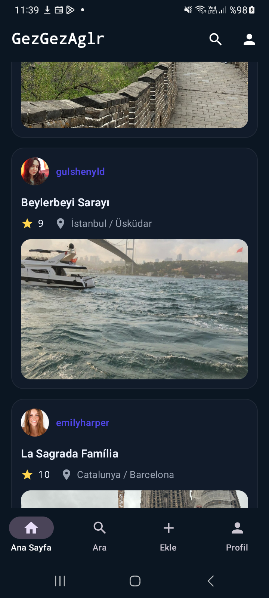
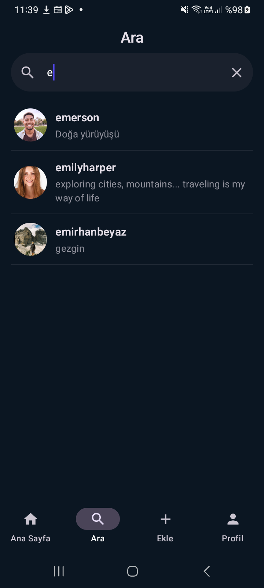

# GezGezAglr — Gezgin (Android / Jetpack Compose)

## Özellikler
- **Alt sekmeli gezinti:** Ana Sayfa, Ara, Ekle, Profil.
- **Gönderi paylaşımı:** Başlık, açıklama, 0–10 puan, fotoğraf, konum bilgisi.
- **Konum seçimi:** Mevcut konumu alma + harita üzerinden nokta seçme.
- **Akış:** Takip edilen kullanıcıların gönderileri yeni→eski sıralı listelenir.
- **Profil:** Profil fotoğrafı, bio, takipçi/takip edilen sayıları, kullanıcı gönderileri.
- **Arama:** Kullanıcı adına göre arama (Firestore başlangıç/bitis aralığı).

## Teknolojiler
- **Kotlin**, **Jetpack Compose (Material3)**
- **Firebase Auth**, **Cloud Firestore**, **Firebase Storage**
- **Coil** (görseller), **OSMDroid** (harita), **Google Location Services**

## Ekranlar
- **HomeScreen:** Ana akış ve alt gezinme.
- **SearchTabScreen:** Kullanıcı arama.
- **CreatePostScreen:** Fotoğraf ekleme, puanlama, konum seçimi ve paylaşım.
- **UserProfileScreen / EditProfileScreen:** Profil görüntüleme ve düzenleme.
- **Followers/Following:** (İsteğe bağlı/planlanan rotalar).

## Kurulum
1. Depoyu klonlayın:
   ```bash
   git clone https://github.com/mertcantopcu01/GezGezAglr.git
   ```
2. Android Studio (Giraffe+ / Iguana+) ile açın.
3. **Firebase kurulumu:**
   - Firebase Console’da bir proje oluşturun.
   - `google-services.json` dosyasını `app/` klasörüne ekleyin.
   - Authentication (Email/Password), Firestore ve Storage’ı etkinleştirin.
4. OSMDroid ve konum izinleri için `AndroidManifest.xml`’de gerekli izinleri ekleyin:
   ```xml
   <!-- gerekli izinler -->
   ```
5. Çalıştırın.

## Proje Yapısı (kısa)
```
app/src/main/java/com/example/myapplication/
 ├─ firebase/        # AuthService, FirestoreService, FirebaseStorageService
 ├─ screens/         # Home, Search, CreatePost, Profile vs.
 ├─ navigation/      # (Varsa) route & NavHost düzeni
 └─ ui/              # Tema ve yardımcı UI bileşenleri
```

## Önemli Notlar
- **Puanlama:** UI’da 0–5 yıldız, Firestore’a 0–10 olarak yazılıyor.
- **Görsel yükleme:** Storage’a yüklendikten sonra indirme URL’si gönderiye kaydedilir.
- **Konum:** İzinler verilmezse harita seçimiyle konum ekleme yoluna gidilebilir.

## Yol Haritası / TODO
- [ ] Gönderi detay ekranı (yorumlar, beğeniler)
- [ ] Takip akışında sonsuz kaydırma/paging
- [ ] Profil düzenlemede ek alanlar (kullanıcı adı benzersizliği vb.)
- [ ] Hata ve boş durum ekranlarının iyileştirilmesi
- [ ] Unit/UI testleri

## Örnek Ekran Görselleri
Uygulamanın bazı ekranlarına ait örnek görseller aşağıda yer almaktadır:

| Ekran | Görsel |
|------|--------|
| Gönderi detayı (La Sagrada Família) – başlık, puan, konum ve açıklama |  |
| Ara ekranı (açık tema) – kullanıcı arama listesi |  |
| Giriş ekranı (açık tema) |  |
| Giriş ekranı (koyu tema) |  |
| Kayıt ol ekranı (koyu tema) – profil fotoğrafı ekleme, e-posta, kullanıcı adı, biyografi ve parola alanları |  |
| Kayıt ol ekranı (açık tema) – profil fotoğrafı ekleme, e-posta, kullanıcı adı, biyografi ve parola alanları |  |
| Ana akış ekranı (koyu tema) – gönderi listesi |  |
| Ara ekranı (koyu tema) – kullanıcı arama listesi |  |
| Profil ekranı (koyu tema) – gönderi ve takip bilgileri |  |
| Takip edilenler ekranı (koyu tema) – takip edilen kullanıcı listesi |  |

Bu görseller, uygulamanın temel akış ve ekranlarını görsel olarak tanımanıza yardımcı olur.
