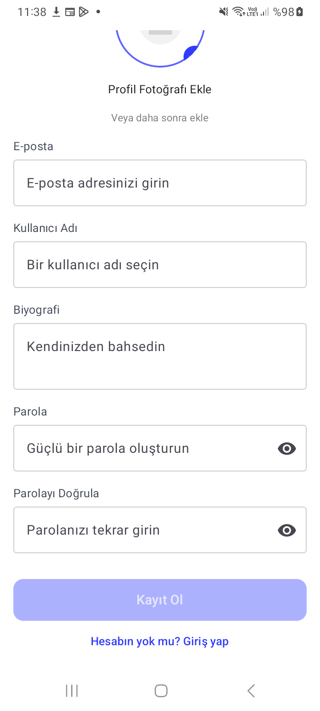
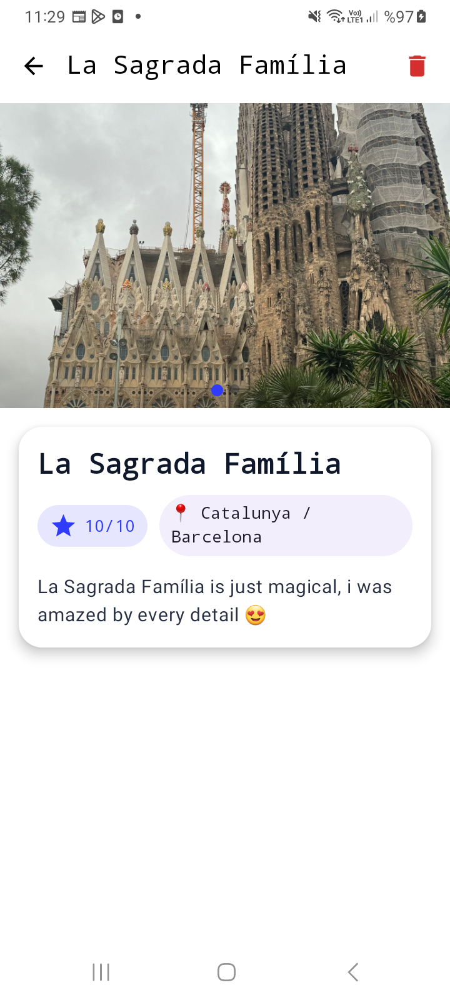
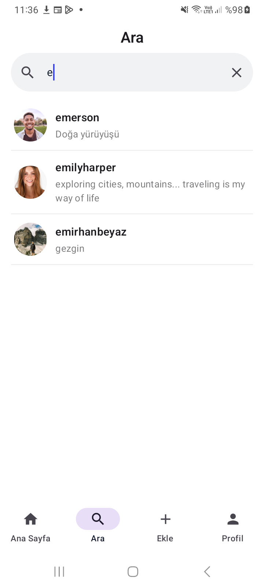
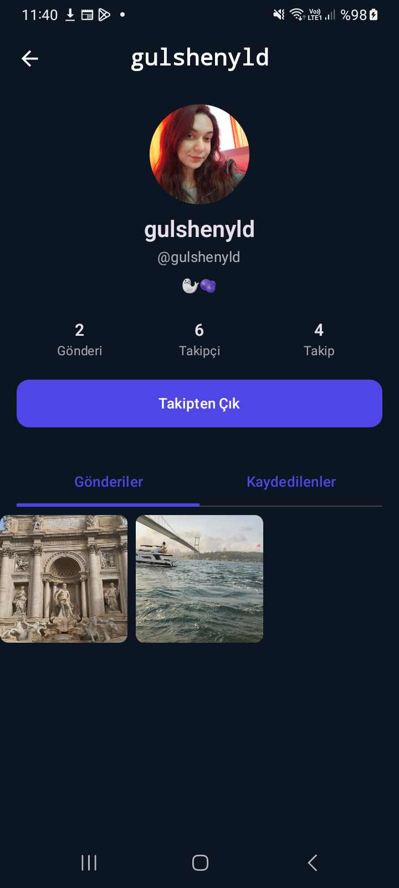
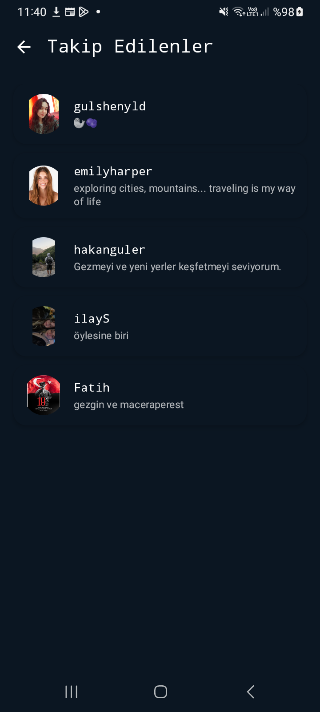

# GezGezAglr — Gezgin (Android / Jetpack Compose)

## Özellikler
- **Alt sekmeli gezinti:** Ana Sayfa, Ara, Ekle, Profil.
- **Gönderi paylaşımı:** Başlık, açıklama, 0–10 puan, fotoğraf, konum bilgisi.
- **Konum seçimi:** Mevcut konumu alma + harita üzerinden nokta seçme.
- **Akış:** Takip edilen kullanıcıların gönderileri yeni→eski sıralı listelenir.
- **Profil:** Profil fotoğrafı, bio, takipçi/takip edilen sayıları, kullanıcı gönderileri.
- **Arama:** Kullanıcı adına göre arama (Firestore başlangıç/bitis aralığı).

## Teknolojiler
- **Kotlin**, **Jetpack Compose (Material3)**
- **Firebase Auth**, **Cloud Firestore**, **Firebase Storage**
- **Coil** (görseller), **OSMDroid** (harita), **Google Location Services**

## Örnek Ekran Görselleri
Uygulamanın bazı ekranlarına ait örnek görseller aşağıda yer almaktadır:

 |
 |
 |
 |
 |
 |
 |
 |
 |
 |

